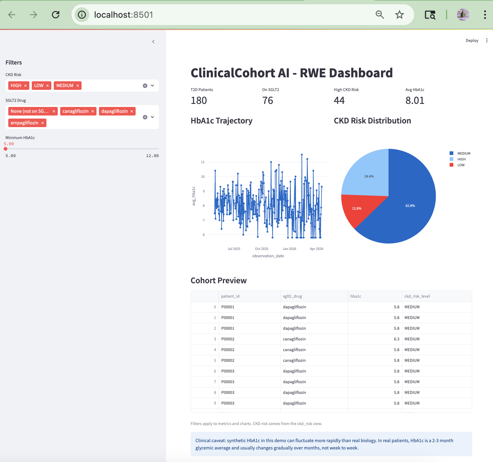

# Repo Walkthrough — ClinicalCohort AI

A self-contained guide to the folder structure, data formats, transformation chain, and how to plug in a new dataset.

---

## 1. Folder Map

```
diabetes_hospitalization_etl/
│
├── etl/                        ← All Python logic (extract → transform → load)
│   ├── pipeline.py             ← MAIN ENTRY POINT (CSV path)
│   ├── pipeline_hl7v2.py       ← MAIN ENTRY POINT (HL7 v2 path)
│   ├── extract_synthea.py      ← Loads raw CSVs *or* generates demo data
│   ├── load_duckdb.py          ← Inserts DataFrames into DuckDB + runs SQL views
│   ├── parse_hl7v2.py          ← Parses raw HL7 v2 segment files → DataFrames
│   ├── data_quality.py         ← DQ checks (PASS/WARN/FAIL), writes reports
│   ├── run_metadata.py         ← Audit log of every pipeline run into DuckDB
│   ├── normalize_codes.py      ← Code constants (ICD-10, LOINC, RxNorm) + helpers
│   ├── generate_sample_fhir.py ← Writes sample FHIR Bundle JSON for reference
│   ├── generate_sample_hl7v2.py← Writes sample HL7 v2 message files for reference
│   └── mimic_adapter_stub.py   ← Stub showing how a MIMIC-IV adapter would look
│
├── sql/                        ← All SQL (schema + analytical views)
│   ├── schema.sql              ← CREATE TABLE statements (6 canonical tables)
│   ├── views_t2d.sql           ← t2d_patients: patients with ICD-10 E11.*
│   ├── views_exposure.sql      ← sglt2_exposure: SGLT2 drug prescriptions
│   ├── views_labs.sql          ← hba1c_trajectory: HbA1c time series + LAG window
│   ├── views_risk.sql          ← ckd_risk: eGFR-based HIGH/MEDIUM/LOW buckets
│   └── views_final_cohort.sql  ← rwe_cohort: joined view powering the dashboard
│
├── dashboard/
│   └── app.py                  ← Streamlit dashboard (reads from rwe_cohort)
│
├── agent/
│   ├── text_to_sql.py          ← CLI text-to-SQL agent (Anthropic API, SELECT-only)
│   └── prompt_template.txt     ← System prompt listing allowed tables + schema
│
├── data/
│   ├── raw/synthea/
│   │   ├── fhir/               ← Sample FHIR Bundle JSON (P00001.bundle.json …)
│   │   ├── hl7v2/              ← Sample HL7 v2 messages (P00001.hl7 …)
│   │   └── csv/                ← DROP YOUR REAL CSVs HERE (see §5)
│   └── processed/
│       ├── demo_csv/           ← Auto-generated demo CSVs (created by pipeline)
│       ├── from_hl7v2/         ← Tables parsed out of HL7 v2 files
│       └── reports/            ← dq_report.md / dq_report.json (DQ output)
│
├── db/
│   └── clinical.duckdb         ← The analytical database (rebuilt on every run)
│
├── tests/                      ← Pytest suite
├── scripts/                    ← Shell convenience wrappers
├── docs/                       ← This file + INTERVIEW_DEMO.md + PHASE3.md
├── Makefile                    ← Short-form targets: make run, make dashboard …
└── .env.example                ← Copy to .env and add ANTHROPIC_API_KEY
```

---

## 2. Entry Points

| What you want | Command |
|---|---|
| Full demo pipeline (CSV path) | `make run` or `bash scripts/run_pipeline.sh` |
| HL7 v2 pipeline | `make run-hl7` or `python -m etl.pipeline_hl7v2` |
| Phase II (DQ + reports) | `make phase2` or `bash scripts/run_phase2.sh` |
| Phase III (audit + CI checks) | `make phase3` or `bash scripts/run_phase3.sh` |
| Launch dashboard | `make dashboard` or `streamlit run dashboard/app.py` |
| Text-to-SQL agent | `python -m agent.text_to_sql` |
| Run tests | `make test` or `pytest tests/` |

All Python commands must use the venv: `.venv/bin/python -m …` or `make` (which sets the path automatically).

---

## 3. Data Formats

### 3a. Canonical tables (what DuckDB stores)

Six tables defined in `sql/schema.sql`. Every pipeline path — CSV, HL7, future MIMIC — must produce DataFrames matching these columns exactly before calling `load_duckdb.rebuild_database()`.

| Table | Key columns | Code system used |
|---|---|---|
| `patients` | patient_id, birth_date, gender, race | — |
| `encounters` | encounter_id, patient_id, encounter_date, encounter_type | — |
| `conditions` | patient_id, icd10_code, onset_date | **ICD-10-CM** |
| `observations` | patient_id, loinc_code, value, unit, observation_date | **LOINC** |
| `medications` | patient_id, rxnorm_code, drug_name, start_date | **RxNorm** |
| `claims` | patient_id, cpt_code, icd10_primary, amount_billed | **CPT / ICD-10** |

### 3b. Demo CSV (auto-generated synthetic data)

Located at `data/processed/demo_csv/`. One CSV per table. Generated by `etl/extract_synthea.py → _generate_demo_dataset()` when no real data is found. These are the files the dashboard is actually reading — safe to inspect or replace.

### 3c. FHIR Bundles (`data/raw/synthea/fhir/`)

Sample JSON files showing what real Synthea FHIR output looks like. Currently read-only examples. To wire FHIR into the pipeline you would write a loader in `etl/` that parses the Bundle resources into the 6 canonical DataFrames.

### 3d. HL7 v2 messages (`data/raw/synthea/hl7v2/`)

Pipe-delimited segment files (MSH, PID, PV1, DG1, OBX, RXE, FT1). Parsed by `etl/parse_hl7v2.py`. The HL7 pipeline (`etl/pipeline_hl7v2.py`) reads these files and produces the same 6 canonical tables as the CSV pipeline.

---

## 4. Transformation Chain (end-to-end)

```
[Raw source]
     │
     ▼
etl/extract_synthea.py          -- Load raw CSVs or generate demo data
     │  produces: dict of 6 pandas DataFrames (one per canonical table)
     │
     ▼
etl/load_duckdb.py:rebuild_database()
     │  step 1: DROP + CREATE tables from sql/schema.sql
     │  step 2: INSERT DataFrames into tables
     │  step 3: execute all sql/views_*.sql files
     │
     ▼
DuckDB views (sql/)
     │
     │  views_t2d.sql      → t2d_patients   (filter ICD E11.*)
     │  views_exposure.sql → sglt2_exposure (filter RxNorm codes / drug names)
     │  views_labs.sql     → hba1c_trajectory (LOINC 4548-4, LAG window function)
     │  views_risk.sql     → ckd_risk       (LOINC 33914-3 eGFR → HIGH/MED/LOW)
     │  views_final_cohort.sql → rwe_cohort (JOIN of all 4 views above)
     │
     ▼
dashboard/app.py                -- Streamlit queries rwe_cohort (+ ckd_risk join)
```

This is what that final dashboard layer looks like when the pipeline has already built the cohort views and metrics:



### Code lookups used in the views

All code constants live in `etl/normalize_codes.py`. That is the single source of truth — change a code there and the views pick it up automatically on next pipeline run.

| Concept | Code system | Value |
|---|---|---|
| Type 2 Diabetes | ICD-10-CM | `E11.*` (prefix match) |
| HbA1c lab | LOINC | `4548-4` |
| eGFR lab | LOINC | `33914-3` |
| Creatinine lab | LOINC | `2160-0` |
| CKD diagnosis | ICD-10-CM | `N18.*` |
| Empagliflozin | RxNorm | `2200644` |
| Canagliflozin | RxNorm | `1545149` |
| Dapagliflozin | RxNorm | `1488574` |

---

## 5. Plugging In a New Dataset (e.g., from Kaggle)

### Step 1 — Get the data into the canonical CSV shape

Drop six CSV files into `data/raw/synthea/csv/` with these **exact column names** (see `sql/schema.sql` for types):

```
patients.csv       → patient_id, birth_date, gender, race, ethnicity, state, zip
encounters.csv     → encounter_id, patient_id, encounter_date, encounter_type, provider_id, payer, total_cost
conditions.csv     → condition_id, patient_id, encounter_id, icd10_code, icd10_description, onset_date, resolution_date
observations.csv   → observation_id, patient_id, encounter_id, loinc_code, loinc_description, value, unit, observation_date
medications.csv    → medication_id, patient_id, encounter_id, rxnorm_code, ndc_code, drug_name, start_date, stop_date, dosage
claims.csv         → claim_id, patient_id, encounter_id, claim_date, cpt_code, icd10_primary, payer, amount_billed, amount_paid
```

If the source dataset uses different column names, write a thin mapping inside `etl/extract_synthea.py` in the `load_synthea_or_demo()` function (there is already a branch there for when `raw_csv_dir` exists).

### Step 2 — Ensure correct code values

The pipeline filters on specific code values. Make sure your source data uses:
- ICD-10-CM codes (e.g., `E11.9`) in `conditions.icd10_code`
- LOINC codes (e.g., `4548-4`) in `observations.loinc_code`
- RxNorm codes **or** the drug names `empagliflozin`, `canagliflozin`, `dapagliflozin` in `medications`

If your dataset uses different codes (e.g., ICD-9, SNOMED), add a translation step in `etl/normalize_codes.py`.

### Step 3 — Run the pipeline

```bash
make run
# or
bash scripts/run_pipeline.sh
```

The pipeline will detect the CSV files in `data/raw/synthea/csv/` and load them instead of generating demo data. DuckDB is fully rebuilt from scratch on every run.

### Step 4 — Check data quality

```bash
make dq
# or
python -m etl.data_quality
```

Opens `data/processed/reports/dq_report.md` — look for WARN/FAIL rows. Common issues with real data:
- Missing LOINC codes → HbA1c trajectory will be empty
- ICD codes in wrong format → T2D cohort will be empty
- No SGLT2 RxNorm codes → drug exposure view will be empty

### Step 5 — Ask a new question

Either edit the SQL views in `sql/` directly, or:

```bash
python -m agent.text_to_sql
> How many patients with HIGH CKD risk were on dapagliflozin for more than 90 days?
```

---

## 6. Where to Customize

| Goal | File to edit |
|---|---|
| Change which condition defines the cohort | `sql/views_t2d.sql` — change `E11%` to any ICD prefix |
| Add a new drug class | `etl/normalize_codes.py` + `sql/views_exposure.sql` |
| Add a new lab outcome | `sql/views_labs.sql` — add another LOINC code block |
| Change CKD risk eGFR thresholds | `sql/views_risk.sql` — CASE WHEN values |
| Add new dashboard panels | `dashboard/app.py` — add a `st.subheader` + `conn.execute` block |
| Change AI agent behavior | `agent/prompt_template.txt` + `agent/text_to_sql.py` |
| Add a new code system mapping | `etl/normalize_codes.py` |

---

## 7. Caveats vs Real Data

| Aspect | This demo | Real-world data |
|---|---|---|
| **Patient source** | Synthea synthetic data (no real patients) | EHR export, claims feed, MIMIC-IV |
| **HbA1c trajectory** | Gradual model (~0.2 change/step), but still noisier than biology | 2–3 month glycemic average; changes are slow and smooth |
| **Drug exposure** | Binary (on/off), no dose titration | Includes dose, refill gaps, switch events |
| **ICD codes** | Clean, always well-formed | May be ICD-9, malformed, or missing |
| **LOINC codes** | Always exactly `4548-4` | Labs often arrive as free text or local codes requiring a LOINC mapping table |
| **RxNorm codes** | Present for SGLT2 drugs only | Need full drug lookup (NDC → RxNorm normalization) |
| **eGFR / CKD** | Single minimum value; N18.* diagnosis count | Requires GFR staging over time, CKD-EPI formula from creatinine + demographics |
| **Claims** | Synthetic amounts | Real amounts require contractual adjustment, DRG grouping |
| **Time range** | HbA1c view filters to last 12 months from run date | Must be parameterized with a study window |
| **Missing data** | Very low by design | Real data has 20–40% missingness on labs; needs imputation strategy |
| **De-identification** | Not applicable (synthetic) | Real data needs Safe Harbor or Expert Determination PHI removal |
